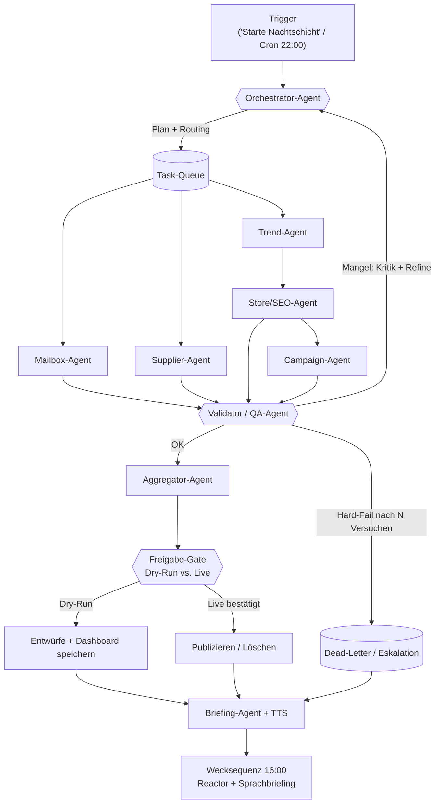

# JARVIS V6 — Multi-Agenten-Architektur (Nachtschicht-Protokoll)

Entwurf eines mehrstufigen, agentischen KI-Systems für die autonome
Nachtschicht von **Fashion Aura**: E-Mail-Hygiene, Lieferanten-Recherche,
Markttrend-Analyse, Store-/SEO-Optimierung und das gesprochene 16:00-Briefing.
Das Design ist direkt an den vorhandenen Code (`jarvis_v6/`) angedockt.

---

## 1. Zielsetzung & Prinzipien

- **Autonom, aber sicher:** läuft nachts ohne Aufsicht, aber jede Aktion mit
  Außenwirkung (Mail löschen, publizieren) ist hinter einem Freigabe-Gate.
- **Spezialisierte Agenten** statt eines Monolithen → testbar, austauschbar,
  skalierbar.
- **Selbstkorrektur:** ein Validator-Agent prüft jede Ausgabe und schickt sie
  bei Mängeln in eine Feedback-Schleife zurück (Refine bis „gut genug").
- **Ehrliche Ergebnisse:** das Briefing meldet echte Zahlen; Übersprungenes /
  Dry-Run wird als solches benannt.

---

## 2. Flussdiagramm



### ASCII-Variante (für unterwegs)

```
 Trigger (22:00 / Sprachbefehl)
        |
   [Orchestrator]  <----------- Feedback (Refine) ------------+
        |  plant & verteilt                                   |
        v                                                     |
   ( Task-Queue )                                             |
    |     |     |                                             |
    v     v     v                                             |
 Mailbox Supplier Trend ---> Store/SEO ---> Campaign          |
    \     |     /                |              |              |
     \    |    /                 v              v              |
      v   v   v   <----------- [Validator / QA] --------------+
     [ Validator prüft jede Ausgabe ]   |OK            |Hard-Fail
                 |OK                     v             v
                 v                  [Aggregator]   (Dead-Letter)
            [Aggregator] ----> [Freigabe-Gate]         |
                                  |Dry-Run |Live        |
                                  v        v            |
                              Entwürfe  Publizieren      |
                                  \        /            /
                                   v      v            v
                               [ Briefing-Agent + TTS ]
                                        |
                                Wecksequenz 16:00 Uhr
```

---

## 3. Die Agenten im Detail

Format je Agent: **Rolle · Inputs · Outputs · Entscheidungslogik**.

### 3.1 Orchestrator-Agent (Dirigent)
- **Rolle:** plant den Lauf, verteilt Aufgaben, steuert Feedback-Schleifen,
  erzwingt Abhängigkeiten (Trend **vor** Store).
- **Inputs:** Trigger-Event, Konfiguration, Validator-Verdikte.
- **Outputs:** Task-Aufträge in die Queue, Endstatus.
- **Entscheidungslogik:**
  - Abhängigkeitsgraph auflösen → unabhängige Tasks parallel, abhängige seriell.
  - Bei Validator-„Mangel": Task mit angehängter Kritik **erneut** einplanen,
    `versuch += 1`, bis `MAX_REFINE` (z. B. 2) erreicht → dann Dead-Letter.
  - Globale Zeit-/Kostenbudgets überwachen; bei Überschreitung niedrigpriore
    Tasks abwerfen.
- **Code:** `NightShiftSupervisor` (`main.py`).

### 3.2 Mailbox-Agent
- **Rolle:** Postfach klassifizieren, Spam markieren, Leads herausziehen.
- **Inputs:** IMAP-Zugang, Klassifikator-Schwellen.
- **Outputs:** `{scanned, spam, leads, lead_items}`, `leads.json`.
- **Entscheidungslogik:** transparenter Score `spam` vs. `lead`; nur wenn
  `spam ≥ Schwelle UND spam > lead` → Spam. Aktion (Verschieben in Papierkorb)
  **nur** wenn `dry_run=False`. Nie hart löschen.
- **Code:** `integrations/mailbox.py`.

### 3.3 Supplier-Agent
- **Rolle:** neue Lieferanten/Großhändler finden.
- **Inputs:** Quell-URLs, „seen"-Set (Deduplizierung).
- **Outputs:** `{found, new, items}`, `suppliers.json`.
- **Entscheidungslogik:** Links extrahieren → nach Lieferanten-Signalwörtern
  filtern → gegen „seen" deduplizieren → nur Neues melden (idempotent).
- **Code:** `integrations/suppliers.py`.

### 3.4 Trend-Agent
- **Rolle:** Markttrends scoren, Winning Products wählen.
- **Inputs:** Trend-Feed (Suchvolumen, Wachstum, Wettbewerb, Marge).
- **Outputs:** gerankte Produkte + `winning_products.json`.
- **Entscheidungslogik:** gewichteter Score (Nachfrage + Wachstum + Marge −
  Wettbewerb); Top-N über Schwelle = Gewinner. **Speist** den Store-Agent.
- **Code:** `integrations/trends.py`.

### 3.5 Store/SEO-Agent
- **Rolle:** SEO-Texte (Title ≤60, Meta ≤160, Slug, Tags) erzeugen.
- **Inputs:** Produktkatalog + Gewinner-Scores.
- **Outputs:** SEO-Entwürfe je Produkt (`store_drafts.json`).
- **Entscheidungslogik:** deterministische Templates; Live-Publish nur bei
  `dry_run=False` **und** Domain/Token **und** `confirm_live=True` (Dreifach-Gate).
- **Code:** `integrations/store.py`.

### 3.6 Campaign-Agent
- **Rolle:** Werbekampagnen-Entwürfe (Headlines, Text, Budget, Zielgruppe).
- **Inputs:** Produkt + Trend-Score.
- **Outputs:** Kampagnen-Entwürfe (Status `DRAFT`).
- **Entscheidungslogik:** Budget skaliert mit Score. **Schaltet nie automatisch**
  (bezahlte Ads = Menschenentscheidung).
- **Code:** `build_campaign()` in `integrations/store.py`.

### 3.7 Validator / QA-Agent (Critic) — *empfohlene Erweiterung*
- **Rolle:** Qualitäts-Torwächter; prüft jede Agenten-Ausgabe gegen Regeln.
- **Inputs:** Agenten-Output + Regelsatz (Schema, Längen, Plausibilität).
- **Outputs:** `OK` **oder** strukturierte Kritik (`{feld, problem, vorschlag}`).
- **Entscheidungslogik:**
  - Harte Regeln (Schema/Längen/verbotene Inhalte) → bei Verstoß sofort Kritik.
  - Plausibilität (z. B. „0 gescannte Mails, aber Konto vorhanden?") → Warnung.
  - LLM-Self-Critique für Texte (SEO/Kampagne) mit Bewertung 0–100; unter
    Schwelle → Refine.
  - Verdikt an Orchestrator: `OK | REFINE(kritik) | FAIL`.
- **Status:** im Code noch nicht vorhanden → konkreter nächster Schritt.

### 3.8 Aggregator-Agent
- **Rolle:** Ergebnisse sammeln, konsolidieren, Dashboard-Artefakte schreiben.
- **Inputs:** alle validierten TaskResults.
- **Outputs:** Gesamtstatus + Dashboard-JSONs.
- **Code:** Ergebnis-Sammlung in `run_tasks()` + `integrations/dashboard.py`.

### 3.9 Briefing-Agent (Sprecher)
- **Rolle:** aus echten Ergebnissen das deutsche Executive-Briefing bauen und
  per TTS sprechen; Wecksequenz auslösen.
- **Inputs:** aggregierte Ergebnisse, Uhr.
- **Outputs:** Briefing-Text + Sprachausgabe + Reactor-Wecksequenz.
- **Entscheidungslogik:** Template aus realen Zahlen füllen; Fehler als
  „Achtung …" voranstellen; Dry-Run kennzeichnen.
- **Code:** `Briefing` + `speak()` (`main.py`), Web/`jarvis_app.html`.

---

## 4. Routing-Logik

1. **Abhängigkeits-Routing:** Trend → Store → Campaign seriell; Mailbox &
   Supplier laufen parallel dazu.
2. **Prioritäts-Routing:** geschäftskritisch (Leads, Store) vor „nice to have"
   (Cache, Supplier) bei knappem Zeitbudget.
3. **Fähigkeits-Routing:** Klassifikation → günstiges/kleines Modell;
   kreative Texte (SEO/Kampagne) → starkes Modell. Spart Kosten ohne
   Qualitätsverlust.
4. **Content-Routing:** Validator entscheidet `OK → Aggregator`,
   `REFINE → Orchestrator`, `FAIL → Dead-Letter`.

---

## 5. Validierung & Feedback-Schleifen (Refine bis Abschluss)

```
Agent-Output --> Validator
   |OK| --> Aggregator (fertig)
   |REFINE(kritik)| --> Orchestrator --> selber Agent (Versuch+1)
                                   ^___________ bis Score≥Schwelle
                                                oder Versuch=MAX_REFINE
   |MAX erreicht| --> Dead-Letter + Eskalation im Briefing
```

- **Abbruchkriterium:** Score ≥ Schwelle **oder** `MAX_REFINE` erreicht — so
  terminiert die Schleife garantiert (keine Endlosschleife).
- **Kritik ist strukturiert** (Feld/Problem/Vorschlag), damit der Agent gezielt
  nachbessert statt blind neu zu generieren.

---

## 6. Fehlerbehandlung (Failure Handling)

| Fehlerart | Strategie |
|---|---|
| **Transient** (Timeout, 5xx, Netz) | Exponentielles Backoff (2/4/8/16 s), begrenzte Retries |
| **Agent-Absturz** | `_guarded()` fängt Exception → `TaskResult(ok=False)`; ein Crash killt nie den Lauf |
| **Externer Dienst down** | **Circuit-Breaker** je Dienst: nach X Fehlern öffnen, Task überspringen, im Briefing melden |
| **Schlechte Qualität** | Validator-Refine-Schleife (Abschnitt 5) |
| **Wiederholte Ausführung** | **Idempotenz**: „seen"-Sets, Mail-UIDs, Entwürfe → at-least-once ist sicher |
| **Gefährliche Aktion** | **Freigabe-Gate** (Dry-Run + `confirm_live`); Default = nichts verändern |
| **Endgültiger Fehler** | **Dead-Letter-Queue** + Eskalation: „Achtung: X fehlgeschlagen" im Briefing |

---

## 7. Optimierung

- **Parallelität:** begrenzter `ThreadPoolExecutor` (nicht alle Kerne auf 100 %).
- **Scheduler:** schläft bis zur Weckzeit statt Busy-Loop → minimale Last.
- **Caching / Inkrementell:** HTTP-Cache, „seen"-Sets, nur Deltas verarbeiten.
- **LLM-Kosten:** Prompt-Caching, Batch-Aufrufe, Modell-Routing (klein vs. groß),
  Token-Budgets je Agent.
- **Schwellen-Tuning:** Spam-/Trend-Schwellen aus Feedback nachziehen.
- **Beobachtbarkeit:** je Agent `duration_s` + Metriken loggen → Engpässe sehen.

---

## 8. Skalierbarkeit (für echten Einsatz)

- **Zustandslose Agenten + zentrale Queue** (Redis/RQ, Celery, SQS) →
  horizontale Worker, einfach hochskalierbar.
- **Idempotente Tasks** → „at least once" unkritisch, Wiederholungen sicher.
- **Persistenz:** Artefakte in DB statt JSON-Dateien, sobald mehrere Worker.
- **Mandantenfähig:** Config-Namespaces pro Shop/Postfach → ein System, viele
  Fashion-Aura-Instanzen.
- **Backpressure:** Queue-Limits + Prioritäten verhindern Überlast.
- **Deployment:** ein Dauerprozess (Pi/VPS/Container) + Cron-Trigger;
  Health-Checks und Auto-Restart.

---

## 9. Mapping: Design → vorhandener Code

| Agent | Datei / Funktion | Status |
|---|---|---|
| Orchestrator + Scheduler | `main.py` (`NightShiftSupervisor`, `_sleep_until`) | ✅ vorhanden |
| Mailbox-Agent | `integrations/mailbox.py` | ✅ |
| Supplier-Agent | `integrations/suppliers.py` | ✅ |
| Trend-Agent | `integrations/trends.py` | ✅ |
| Store/SEO + Campaign | `integrations/store.py` | ✅ |
| Aggregator | `run_tasks()` + `integrations/dashboard.py` | ✅ |
| Freigabe-Gate | `dry_run` / `confirm_live` | ✅ |
| Briefing-Agent + TTS | `Briefing`, `speak()`, `jarvis_app.html` | ✅ |
| **Validator / QA-Agent** | — | ⏳ empfohlen als nächster Schritt |

---

## 10. Nächste Schritte zur echten Umsetzung

1. **Validator-Agent** als eigenes Modul (`integrations/validator.py`) mit
   Regelsatz + optionaler LLM-Self-Critique einführen und in die
   Supervisor-Schleife einhängen (Refine-Loop scharf schalten).
2. **Queue-Backend** (RQ/Celery) einführen, sobald mehr als ein Worker nötig ist.
3. **Circuit-Breaker** je externem Dienst ergänzen.
4. **Metriken/Tracing** je Agent exportieren (Prometheus/Logfile).
5. **Trigger** per Cron (z. B. 22:00) zusätzlich zum manuellen Start.
